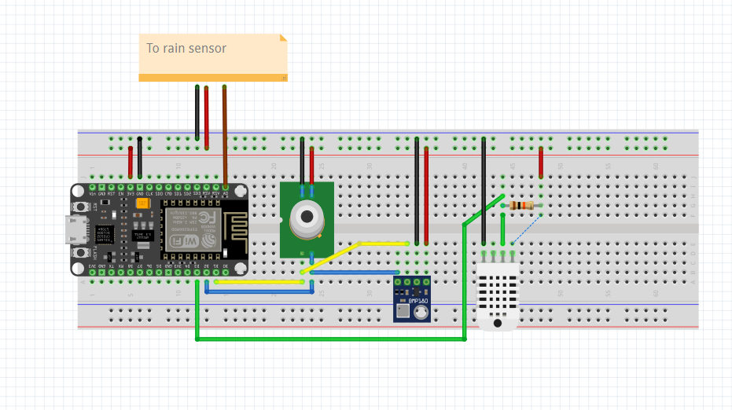

# NINA-ASCOM Safety Monitor

Este projeto implementa uma estação meteorológica automática com NodeMCU ESP-12E para atuar como monitor de segurança (safety monitor) para sessões de astrofotografia utilizando o software NINA.

## Hardware Utilizado
- NodeMCU 1.0 (ESP-12E Module)
- DHT11 (temperatura e umidade)
- BMP280 (pressão atmosférica)
- MLX90614 (temperatura do céu - detecção de nuvens)
- Sensor de chuva analógico

## Funcionalidade
A estação publica os dados dos sensores via interface web e, em caso de condições climáticas adversas, pode interromper sessões de captura e acionar o fechamento seguro do observatório.

## Esquemático

## Código
O código-fonte está no arquivo `Estacao_meteorologica_observatorio.ino`.

## Como usar
1. Faça upload do código para o NodeMCU via Arduino IDE.
2. Conecte os sensores conforme o esquema acima.
3. Acesse o IP do ESP em sua rede local para visualizar os dados.
